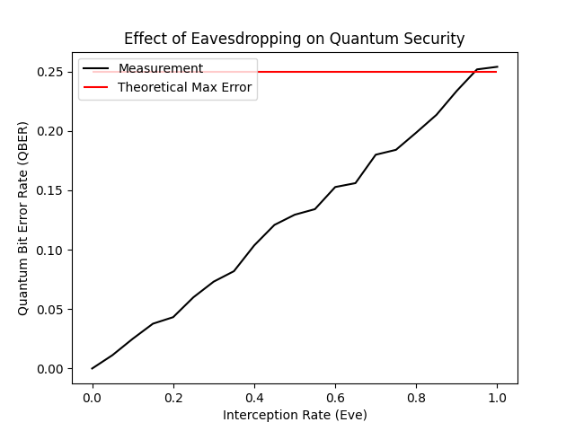

# BB84 Quantum Key Distribution (QKD) Simulator



## Overview
This project is a Python-based simulation of the **BB84 Protocol**, the first quantum cryptography scheme. It demonstrates how the fundamental laws of quantum mechanics—specifically the **No-Cloning Theorem** and **Wavefunction Collapse**—guarantee secure communication.

The simulator models the transmission of qubits between two parties (Alice and Bob) and quantitatively analyzes the statistical noise introduced by an eavesdropper (Eve). It uses **Linear Algebra** (vector states and inner products) to calculate measurement probabilities and simulate quantum state collapse.

## Key Features
* **Quantum State Simulation:** Models qubits as normalized vectors in a 2D Hilbert space using **NumPy**.
* **Dual-Channel Architecture:** Simulates both the Quantum Channel (qubit transmission) and the Classical Channel (sifting/basis comparison).
* **Eavesdropping Module (Eve):** Implements the "Intercept-Resend" attack strategy with a configurable interception rate.
* **Statistical Analysis:** automated calculation of the **Quantum Bit Error Rate (QBER)** to detect intrusion.
* **Monte Carlo Simulation:** Runs experiments across varying interception rates to demonstrate the linear relationship between eavesdropping and error generation.

## Technical Concepts

### 1. The Physics (Linear Algebra)
The simulation represents polarization states as column vectors. Measurement is modeled as the projection of the state vector onto a basis vector.

* **Standard Basis ($+$):**
    * $|0\rangle = [1, 0]^T$ (Vertical)
    * $|1\rangle = [0, 1]^T$ (Horizontal)
* **Hadamard Basis ($\times$):**
    * $|+\rangle = \frac{1}{\sqrt{2}}[1, 1]^T$ (Diagonal)
    * $|-\rangle = \frac{1}{\sqrt{2}}[1, -1]^T$ (Anti-Diagonal)

The probability of measuring state $|\psi\rangle$ in basis $|\phi\rangle$ is calculated via the Born Rule:
$$P = |\langle \psi | \phi \rangle|^2$$

### 2. The Security Principle
If an eavesdropper (Eve) intercepts a photon, she must measure it to read the information. Due to the **Heisenberg Uncertainty Principle**, measuring in the wrong basis disturbs the quantum state.
* If Eve intercepts 100% of the photons, the QBER rises to **~25%**.
* This statistical anomaly alerts Alice and Bob to the presence of the spy, allowing them to discard the compromised key.

## Installation & Usage

### Prerequisites
* Python 3.8+
* NumPy
* Matplotlib

### Installation
1.  Clone the repository:
    ```bash
    git clone https://github.com/leoccom/bb84-qkd-simulator.git
    cd bb84-qkd-simulator
    ```
2.  Install dependencies:
    ```bash
    pip install -r requirements.txt
    ```

### Running the Simulation
To run the full experiment and generate the QBER analysis graph:
```bash
python experiment.py
```